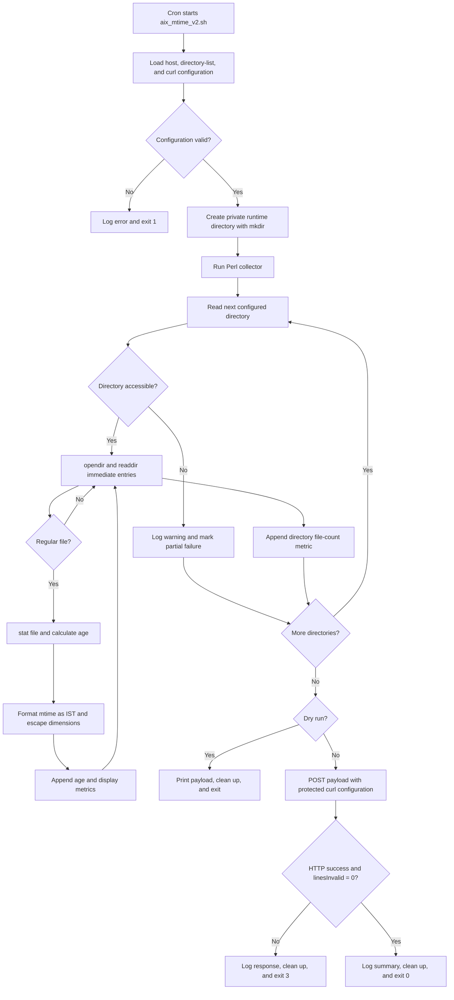

# AIX File Modification Monitor for Dynatrace

## Introduction

This monitor collects information about every regular file immediately inside a configured set of AIX directories and sends it to the Dynatrace Metrics v2 ingest API.

It reports:

- File age in seconds, for charting and alerting.
- File modification time as a human-readable IST dimension.
- The current number of files in each monitored directory.

The monitor does not recurse into nested directories and does not require filenames to be known in advance. It uses Perl `opendir`, `readdir`, and `stat` instead of parsing `ls` or running `find`.

## Runtime flow



## Package contents

| File | Purpose |
|---|---|
| `aix_mtime_v2.sh` | KornShell controller, validation, temporary workspace, API call, and response handling |
| `aix_mtime_collector.pl` | Non-recursive directory enumeration, file `stat`, metric calculation, and payload generation |
| `aix_mtime.conf` | Host and local path configuration |
| `aix_mtime_dirs.conf` | List of directories to monitor |
| `aix_mtime.curl.conf` | Protected Dynatrace endpoint and API-token configuration |
| `tests/run_tests.sh` | Development test suite; not required on the AIX target |

The earlier `aix_mtime_v1.sh` is retained only as a legacy reference and is not used by version 2.

## Requirements

- AIX with `/usr/bin/ksh`
- Perl with the core `Errno`, `Fcntl`, `Getopt::Long`, and `POSIX` modules
- curl with access to the Dynatrace Metrics v2 ingest endpoint
- A Dynatrace API token with `metrics.ingest` or `Ingest metrics` permission, as appropriate for the Managed version
- Read and search permission on every monitored directory, and permission to stat its files

`istat`, GNU `stat`, `find`, and `mktemp` are not required at runtime.

## Installation

Copy the runtime files to a dedicated directory, for example:

```text
/opt/dynatrace/aix-mtime/
```

Set ownership and permissions. Replace `dtmon` and its group with the service account used by the customer:

```sh
chown dtmon:dtmon aix_mtime_v2.sh aix_mtime_collector.pl
chown dtmon:dtmon aix_mtime.conf aix_mtime_dirs.conf aix_mtime.curl.conf

chmod 750 aix_mtime_v2.sh aix_mtime_collector.pl
chmod 640 aix_mtime.conf aix_mtime_dirs.conf
chmod 600 aix_mtime.curl.conf
```

### General configuration

Edit `aix_mtime.conf`:

```ksh
HOST_ID="<Host identifier>"
DIRECTORIES_FILE="${SCRIPT_DIR}/aix_mtime_dirs.conf"
CURL_CONFIG="${SCRIPT_DIR}/aix_mtime.curl.conf"
COLLECTOR="${SCRIPT_DIR}/aix_mtime_collector.pl"

PERL_BIN="/usr/bin/perl"
CURL_BIN="/usr/bin/curl"
RUNTIME_ROOT="/tmp"
MAX_PAYLOAD_BYTES=900000
```

`HOST_ID` must remain stable because it forms part of every metric-series identity.

### Directory configuration

Edit `aix_mtime_dirs.conf`. Specify one absolute directory per line:

```text
# Blank lines and comment lines are ignored.
/path/to/inbound
/path/to/outbound
```

Trailing slashes and duplicate entries are normalized. Leading and trailing whitespace is removed, so directory names that intentionally begin or end with whitespace are not supported.

Only immediate regular files are monitored. Nested directories and special files such as sockets and FIFOs are skipped. Hidden files are included. A symbolic link is included when its target is a regular file because Perl `stat` follows the link.

### Dynatrace connection configuration

Edit `aix_mtime.curl.conf`:

```text
url = "https://<Managed environment>/api/v2/metrics/ingest"
header = "Authorization: Api-Token <API token>"
header = "Content-Type: text/plain; charset=utf-8"
insecure
silent
show-error
fail
connect-timeout = 15
max-time = 60
```

`insecure` is equivalent to `curl -k` and intentionally disables certificate verification for environments with the known CA issue. Remove it when certificate validation is available.

Keeping the API token in a mode-`600` curl configuration prevents it from being stored in the executable script or passed as a command-line header.

## Validation and use

Validate payload generation without contacting Dynatrace:

```sh
./aix_mtime_v2.sh --dry-run
```

Use an alternative general configuration when testing:

```sh
./aix_mtime_v2.sh -c /path/to/test.conf --dry-run
```

Run an actual ingestion:

```sh
./aix_mtime_v2.sh
```

Example cron entry for collection every five minutes:

```cron
*/5 * * * * /opt/dynatrace/aix-mtime/aix_mtime_v2.sh >>/var/log/aix_mtime.log 2>&1
```

Use a collection interval appropriate for the expected file age and the available custom-metric allowance.

## Metrics and dimensions

### `custom.file.age.seconds`

Current collection time minus file modification time.

| Dimension | Meaning |
|---|---|
| `host` | Configured stable host identifier |
| `dir` | Monitored parent directory |
| `filename` | Immediate file name |

Example:

```text
custom.file.age.seconds,host="aix01",dir="/app/inbound",filename="orders.dat" 3600
```

A negative value is retained when the file modification time is in the future, making clock skew visible instead of hiding it.

### `custom.file.mtime.display`

A constant value of `1` with the file modification time formatted as ISO 8601 in Indian Standard Time.

| Dimension | Meaning |
|---|---|
| `host` | Configured stable host identifier |
| `dir` | Monitored parent directory |
| `filename` | Immediate file name |
| `mtime` | File mtime formatted as `YYYY-MM-DDTHH:MM:SS+05:30` |

Example:

```text
custom.file.mtime.display,host="aix01",dir="/app/inbound",filename="orders.dat",mtime="2026-09-25T10:30:00+05:30" 1
```

Each new `mtime` value creates a new dimension tuple. Use a short Data Explorer timeframe when displaying this metric to reduce the chance of showing historical mtime rows.

### `custom.directory.file.count`

Number of immediate regular files successfully inspected in a directory.

| Dimension | Meaning |
|---|---|
| `host` | Configured stable host identifier |
| `dir` | Monitored directory |

Example:

```text
custom.directory.file.count,host="aix01",dir="/app/inbound" 12
```

An accessible empty directory reports `0`. An inaccessible directory produces no count metric and causes a partial-failure exit.

## Sample payload

For a directory containing two files:

```text
custom.file.age.seconds,host="aix01",dir="/app/inbound",filename="orders.dat" 3600
custom.file.mtime.display,host="aix01",dir="/app/inbound",filename="orders.dat",mtime="2026-09-25T10:30:00+05:30" 1
custom.file.age.seconds,host="aix01",dir="/app/inbound",filename="customers.dat" 120
custom.file.mtime.display,host="aix01",dir="/app/inbound",filename="customers.dat",mtime="2026-09-25T11:28:00+05:30" 1
custom.directory.file.count,host="aix01",dir="/app/inbound" 2
```

Backslashes and double quotes in dimension values are escaped according to the Dynatrace metric-ingestion protocol. Filenames containing carriage returns or newlines are skipped because the protocol is line-oriented.

## Dynatrace usage

Suggested Data Explorer views:

- Chart or table `custom.file.age.seconds`, split by `host`, `dir`, and `filename`. Use the last value and configure age thresholds.
- Table `custom.file.mtime.display`, split by `host`, `dir`, `filename`, and `mtime`. Use a short timeframe.
- Chart or single value `custom.directory.file.count`, split by `host` and `dir`. Alert when the value reaches `0` if an empty directory is abnormal.

Because filenames are discovered rather than configured, deletion of one particular file cannot produce a value of `0` for that filename. If per-file disappearance must be detected, configure missing-data alerting for previously observed age series or introduce an expected-file inventory.

## License consumption

These API-ingested custom metrics consume metric data points. Under Dynatrace Classic licensing, each ingested custom metric data point has a weight of `0.001 DDU`, subject to any included custom-metric allowance in the customer's license.

For:

- `F` current files across all configured directories
- `D` configured, accessible directories
- `I` collection interval in minutes

the approximate consumption is:

```text
Data points per run = (2 × F) + D
Data points per year = ((2 × F) + D) × 525,600 ÷ I
DDUs per year = ((2 × F) + D) × 525.6 ÷ I
```

Example: 100 files across 5 directories, collected every 5 minutes:

```text
Data points per run = (2 × 100) + 5 = 205
DDUs per year = 205 × 525.6 ÷ 5 = 21,549.6 DDUs
```

The number of files can change between runs, so actual consumption follows the observed file count. Refer to Dynatrace's current [DDUs for metrics documentation](https://docs.dynatrace.com/docs/manage/subscriptions-and-licensing/monitoring-consumption-classic/davis-data-units/metric-cost-calculation/ddu-migration/) and the customer's contract when estimating billable usage.

The `mtime` dimension also changes whenever a file is modified. This increases metric-series cardinality even though it does not add another payload line during that run.

## Error handling

| Exit code | Meaning |
|---:|---|
| `0` | Collection and ingestion succeeded |
| `1` | Configuration or local setup failure |
| `2` | Collection failed or completed partially |
| `3` | curl, HTTP, response-validation, or Dynatrace line-ingestion failure |

The script validates both the curl exit status and Dynatrace's `linesInvalid` response field. Runtime payload and response files are created under a private, mode-restricted directory and removed by exit and signal traps.

The Metrics v2 API limits a request payload to 1 MB. The collector therefore splits output on metric-line boundaries into batches of at most `MAX_PAYLOAD_BYTES` (900,000 bytes by default), and the controller validates every batch response independently.

## Development tests

The test suite is intended for the development machine and uses Bash utilities that are not runtime dependencies on AIX:

```sh
tests/run_tests.sh
```

It tests age calculation, fixed-offset IST formatting, hidden files, non-recursive enumeration, dimension escaping, empty directories, payload batching, partial collection, dry-run behavior, successful API responses, and rejected metric lines.
